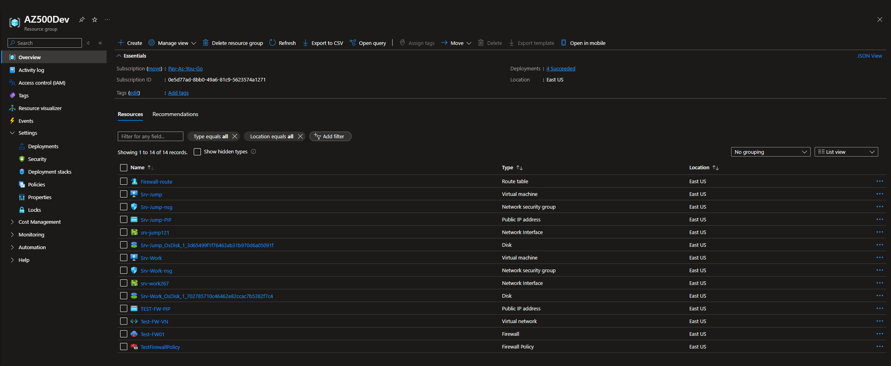
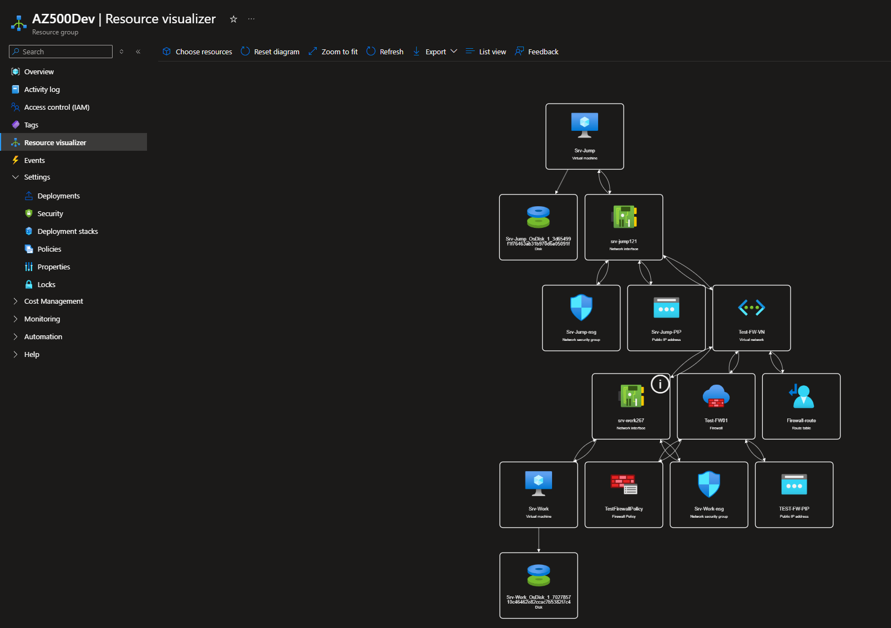

# Azure Firewall Implementation & Policy Configuration

**Type:** Lab Project — AZ-500 Studies  
**Skills:** Network Security, Azure Firewall, Firewall Policies, Route Tables, Network Security Groups (NSGs)  

---

## Overview
As part of my AZ-500 studies, I deployed and configured **Azure Firewall** in a simulated enterprise environment using the Azure Portal.  
This project was based on the [Whizlabs Lab: Deploy and Configure Azure Firewall and Policy](https://www.whizlabs.com/labs/deploy-and-configure-azure-firewall-and-policy-using-the-azure-portal), but includes my own configuration steps, testing, and environment build-out.

---

## Objectives
- Deploy an **Azure Firewall** in a dedicated subnet.
- Create and apply a **Firewall Policy** with network and application rules.
- Configure **Network Security Groups (NSGs)** for inbound and outbound filtering.
- Implement a **Route Table** to direct outbound traffic through the firewall.
- Test connectivity and verify firewall rule enforcement.

---

## What I Did

### 1. Environment Setup
- Created a dedicated **Resource Group** (`AZ500Dev`) for all components.
- Deployed two virtual machines (Jump Host & Work VM) for testing network rules.
- Configured public IPs for controlled access.

### 2. Firewall Deployment
- Created a **Firewall Subnet** within the virtual network.
- Deployed an **Azure Firewall** instance with a dedicated public IP.
- Created and associated a **Firewall Policy** for centralized rule management.

### 3. Network & Application Rules
- Configured **Network Rule Collections** to allow specific outbound traffic.
- Configured **Application Rule Collections** to permit access to allowed domains.
- Applied a default deny rule for unlisted destinations.

### 4. Route Table & Traffic Flow
- Created a **Route Table** directing all outbound traffic to the firewall.
- Associated the route table with the Work VM subnet.

### 5. Security Controls
- Deployed **Network Security Groups** to control access to the jump host.
- Verified rule priority order and effective security rules.

### 6. Testing & Validation
- Confirmed allowed and blocked traffic using both VMs.
- Validated policy enforcement and logging.

---

## Key Takeaways
- **Azure Firewall** provides centralized network traffic control for both inbound and outbound flows.
- **Firewall Policies** make it easier to manage and update rules at scale.
- **NSGs** and route tables complement the firewall to create layered network security.
- Testing in a lab environment allows for safe rule validation without impacting production systems.

---

## Screenshots

**Resource Visualizer — Azure Firewall Environment**

**Resource Group — Deployed Components**

---

## Next Steps
- Integrate firewall logs with Microsoft Sentinel for advanced monitoring.
- Explore **threat intelligence-based filtering**.
- Automate firewall rule deployment using **Azure Policy** or **ARM templates**.

---

## References
- [Azure Firewall Documentation](https://learn.microsoft.com/azure/firewall/)
- [Whizlabs Lab — Azure Firewall](https://www.whizlabs.com/labs/deploy-and-configure-azure-firewall-and-policy-using-the-azure-portal)
